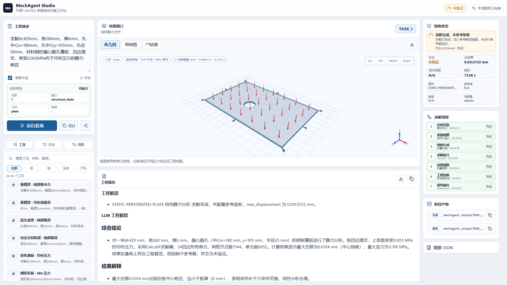
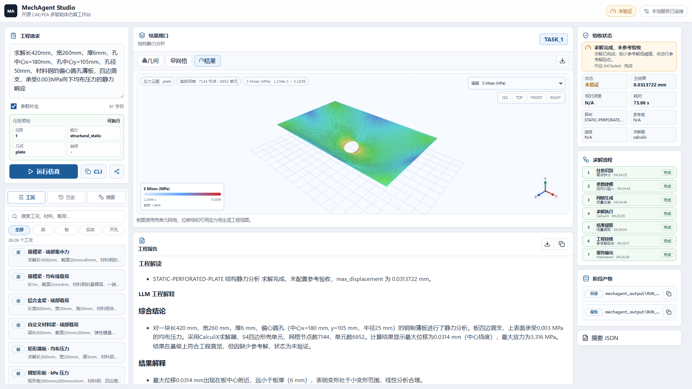

# MechAgent

MechAgent 是面向开源 CAE/FEA 工作流的多智能体仿真产品与编排框架。它提供 MechAgent Studio 本地工作台、CLI 和 Python SDK，把自然语言工程需求转化为可执行、可审计、可复现的仿真任务链路。

用户描述“几何、材料、边界、载荷、分析目标”等工程意图后，系统通过 Planner、Designer、MeshAgent、SolverAgent、PostProcAgent、AnalystAgent 和 ReporterAgent 完成参数建模、网格划分、求解计算、后处理、误差校核和工程报告生成。求解器、网格器、知识源和 LLM 后端通过注册表与配置接入；项目本体是多智能体工作流系统、结构化数据契约、工具适配层、可视化和报告链路。

当前发布能力聚焦结构线弹性静力分析，覆盖梁、矩形板、单孔/偏心孔/多孔薄板和矩形实体块。TC-01 至 TC-05 用于校准求解链路和回归精度；开孔薄板用于展示复杂几何特征、Gmsh 布尔建模、多孔布尔切割、局部网格控制、外边界约束、孔边自由边界、真实求解、结果场和报告输出。独立自然语言案例覆盖常见中文、英文、单位、材料和开孔特征表达。完整产品蓝图、总体架构、3D 可视化目标、进度展示、能力路线和扩展边界见 [docs/product_blueprint.md](docs/product_blueprint.md)。

## Studio 展示



几何可视化态展示自然语言输入、Planner 预检、偏心圆孔薄板参数化几何、边界支承符号、均布压力箭头、全局 XYZ 坐标系、验收状态和求解流程。



结果与工程解读态展示开孔薄板 S Mises 应力云图、真实网格、孔边应力集中、场量切换、验收指标、阶段产物和 Markdown 工程报告。

## 产品入口

| 入口 | 用途 |
| --- | --- |
| MechAgent Studio | 面向工程用户的浏览器工作台，提交自然语言仿真请求并查看预检、几何、网格、结果、流程、误差和报告 |
| CLI | 面向终端与自动化脚本的自然语言预检和仿真入口 |
| Python SDK | 面向二次开发、批处理、服务集成、预检和能力扩展 |

Studio 是默认产品体验。它不是演示页，而是一个本地工程工作台：左侧输入自然语言请求并显示运行前预检，中间展示任务标签、任务结果矩阵、3D 几何/网格/结果视图和 Markdown 报告，宽屏右侧检查区展示作业状态、验收状态、求解流程、带类型标签的阶段产物路径和摘要 JSON；中等宽度时检查区位于主工作区下方，移动端整体单列展示。宽屏检查区使用整列滚动，验收指标面板按内容自适应高度，避免指标卡被内部滚动容器裁切。用户可直接在界面中输入真实工程需求、复制工作台链接、复制 CLI 复现命令、切换几何/网格/结果模式、查看阶段执行状态、对比主结果与参考值，并复制或下载工程报告、复制阶段产物路径、复制或下载摘要 JSON、导出可视化工件。复制动作提供可见状态反馈和无障碍 live region。

## 核心能力

| 模块 | 能力说明 |
| --- | --- |
| SDK / CLI | `MechAgent` SDK 与 `python -m mechagent.cli` |
| Studio UI | FastAPI + React + TypeScript + Vite 工作台；`python -m mechagent.cli studio` 本地启动 |
| Agent 编排 | 默认 LangGraph DAG，节点为 Planner、Designer、MeshAgent、SolverAgent、PostProcAgent、AnalystAgent、ReporterAgent；顺序工作流复用同一组 Agent |
| 能力注册 | `SimulationCapability` 声明 Planner 描述、默认网格器、默认求解器、请求分段器、解析器、执行契约、LLM 抽取契约、模型编号集合、模型归一化函数和结果评价器 |
| 自然语言解析 | 真实工程需求解析为 `ModelParams`；复合请求会拆分为独立任务，无法唯一拆分的请求记录为 `ambiguous_request` |
| LLM Agent | 默认关闭远端 LLM；启用后 Planner 可选择已注册能力并合并能力缺参诊断，Designer 可由 LLM 生成 `ModelParams`，MeshAgent 可生成并校验网格策略，ReporterAgent 基于 FEM 结果生成工程解释 |
| 工具链 | 默认求解器为 CalculiX `ccx`，默认网格器注册名为 `calculix-inp`；矩形板和开孔薄板路径调用 Gmsh Python API，梁和矩形实体块路径使用结构化网格 |
| 后处理与报告 | 解析 `.frd` 位移和应力标量，输出任务摘要、工程解读、错误诊断、LLM 工程解释和阶段产物路径 |
| 知识库 | 默认知识源为 `knowledge/sources`，本地 JSONL 索引融合 BM25 与 TF-IDF 相似度 |

Agent 间通信使用 Pydantic v2 模型。`TaskItem.intent` 承载 `SimulationIntent`，Designer 输出 `DesignAgentOutput`，MeshAgent 输出 `MeshAgentOutput`，求解和后处理阶段输出结构化摘要。SDK/CLI JSON 摘要只暴露脱敏 trace 元数据、错误状态和文本长度，不输出原始 prompt 或 response。核心仿真 schema 拒绝非有限控制数值，几何尺寸、材料参数、载荷幅值/方向、边界值和网格尺寸必须为有限数值。

## 当前工程边界

内置结构静力能力经过真实 CalculiX 验证。梁横向载荷和实体轴向载荷需要显式方向；当前执行契约覆盖梁纯全局 Y 向横向弯曲、矩形板和开孔薄板纯全局 Z 向均布压力弯曲、矩形实体块纯全局 X 向端面轴向载荷。几何必需尺寸、材料、载荷、边界、载荷区域和载荷方向在进入求解器前统一校验。

超出内置材料目录的材料可通过显式 `E` 和 `nu` 定义等效各向同性线弹性参数；混凝土、钢筋混凝土、复合材料等名称不按内置钢/铝别名自动匹配。能力默认工具注册契约要求按注册表名称校验，并在注册时归一化为工厂注册名。

MeshAgent 要求成功网格结果提供 `mesh_file`，质量指标为有限数值，并按 `mesher.min_quality` 校验 `min_*` 质量指标。启用 LLM Agent 时，MeshAgent 可先生成 `seed_size` 与 `element_type` 网格策略建议；建议通过本地 JSON 解析、几何兼容性和网格尺寸范围校验后进入网格器。LangGraph 状态契约校验确保阶段产物数量与活动任务一致。复合请求中的单个任务失败时，失败任务进入错误记录，其余任务继续执行。

## 安装

MechAgent 支持 Python 3.9 及以上版本。建议在独立虚拟环境中安装依赖，避免与系统 Python 或其他工程共享依赖。

Windows `venv`：

```powershell
py -3.9 -m venv .venv
.\.venv\Scripts\Activate.ps1
python -m pip install --upgrade pip
python -m pip install -e packages/mechagent-core
python -m pip install -e "packages/mechagent[dev,docs]"
```

Conda：

```powershell
conda create -n mechagent python=3.9 -y
conda activate mechagent
python -m pip install --upgrade pip
python -m pip install -e packages/mechagent-core
python -m pip install -e "packages/mechagent[dev,docs]"
```

`config/mechagent.yaml` 使用 `${CALCULIX_CCX:-ccx}` 解析求解器路径。本机 `.env` 提供私密配置，仓库只保留 `.env.example` 作为公开模板：

```text
URL=https://example.com/v1
API_KEY=replace-with-openai-compatible-api-key
MODEL_NAME=replace-with-model-name
CALCULIX_CCX=ccx
```

命令示例默认在已激活的虚拟环境中执行。CalculiX 可执行文件通过 `CALCULIX_CCX` 指向本机路径，也可以使用 PATH 中可直接调用的 `ccx`。

## 启动 Studio

```powershell
python -m mechagent.cli studio --open-browser
```

Studio 默认监听 `127.0.0.1:8765`。界面包含自然语言请求区、任务预检、参数补全开关、示例库、运行历史、作业状态、求解流程、3D 结果视口、验收指标、阶段产物路径、摘要 JSON 和 Markdown 报告。工作台 URL 支持 `request`、`llm` 和 `view` 查询参数，打开链接时自动恢复自然语言请求、参数补全状态和 3D 视图模式；界面也可直接复制当前工作台链接。报告和摘要 JSON 均支持复制与下载，便于把同一次仿真的文本结论和结构化结果交给终端、CI、外部数据系统或问题追踪系统复核。CLI 复现命令、工作台链接、报告正文、阶段产物路径和摘要 JSON 的复制结果会在界面底部显示状态反馈。

结果视口使用 Three.js 渲染几何、网格和结果模式；场数据由 Python 后处理层根据求解摘要、`ModelParams`、`.inp` 网格和 `.frd` 位移/应力场生成。浏览器渲染层按几何类型映射求解坐标：梁保持 `X/Y/Z` 表达横向弯曲，矩形板、开孔薄板和矩形实体块将求解 `Z` 轴映射为 Three.js 竖向轴，使薄板挠曲和实体高度按工程视角呈现。开孔薄板几何视图由单孔或多孔参数化轮廓生成，网格与结果视图读取 Gmsh 真实切孔后的 `.inp` 单元。几何模式显示 `ModelParams.loads` 与 `ModelParams.bcs` 对应的前处理符号，包含集中力箭头、线载荷箭头、均布压力箭头、端面载荷、固定端夹持和边界支承；符号直接贴合载荷面或约束边界，不带文字标注。网格模式使用低透明单元面、高对比单元边和节点表达真实 `.inp` 拓扑；梁网格以矩形截面分段棱柱表达 B31 单元拓扑，节点点标记显示单元连接位置，缺少求解产物时标注为示意网格。结果模式只显示变形、网格边、节点场、颜色图例和当前结果场；默认显示 `U` 位移模量，场量下拉菜单可切换 `Ux`、`Uy`、`Uz` 位移分量；`.frd` 存在应力场时可切换 `S Mises`、`Sxx`、`Syy`、`Szz`、`Sxy`、`Syz` 和 `Sxz`。壳单元 `.frd` 派生节点场会按网格节点顺序对齐，上下表面应力以最大 Mises 值作为显示场。结果视口提供等轴、俯视、前视和右视快捷视角，右下角透明嵌入式 XYZ 全局坐标系跟随主相机旋转，颜色图例随当前场量同步。宽屏桌面视口采用左侧输入、中部结果、右侧检查器三栏布局；宽度不超过 1800px 时检查区位于主工作区下方并保持两列排布，宽度不超过 900px 时整体切换为单列布局。运行前、运行中和结果态保持固定响应式断点和面板尺寸约束，避免 3D 画布、报告或检查区造成浏览器横向溢出。Three.js 画布按需渲染，初始化、尺寸变化、视图切换和用户交互触发重绘，静止状态不运行连续动画循环。当前 3D 画布支持 PNG 导出，SVG 用于兼容视图和静态下载。

Studio 启动时输出服务监听地址和浏览器入口。`--open-browser` 打开浏览器入口；监听地址为 `0.0.0.0` 或 `::` 时，浏览器入口使用 `127.0.0.1`。

Studio 的运行路径与 CLI/SDK 共用同一套后端能力。用户提交自然语言请求后，后端按编排图完成任务识别、建模参数生成、网格生成、求解器执行、结果提取、工程校核和报告生成；前端在求解期间显示后端作业编号、作业状态、运行耗时和阶段事件，结果返回后按真实摘要呈现任务状态、可视化结果、验收误差、阶段产物和结构化摘要。

运行前预检由 Planner 和能力注册表生成，不执行网格、求解和后处理。预检结果包含任务数量、能力编号、几何类型、缺项和可执行状态；复合请求会显示已识别的任务数量和几何集合。
CLI 非 JSON 预检输出包含任务概览和完整补参建议，终端宽度较小时不会省略缺失字段。

前端源码位于 `apps/mechagent-studio`。Studio 静态资源随 `mechagent` 包发布；Node 只用于前端开发和构建：

```powershell
npm --prefix apps/mechagent-studio ci --no-audit --no-fund
npm --prefix apps/mechagent-studio run build
```

## 自然语言运行

查看已注册能力、工具绑定和自然语言示例：

```powershell
python -m mechagent.cli capabilities
python -m mechagent.cli capabilities --examples
python -m mechagent.cli capabilities --json
```

查看完整自然语言示例库：

```powershell
python -m mechagent.cli examples
python -m mechagent.cli examples --geometry plate --model-case STATIC-PERFORATED-PLATE
python -m mechagent.cli examples --json
```

运行前预检：

```powershell
python -m mechagent.cli inspect "求解长1000mm、截面20mmx40mm、材料钢的悬臂梁，一端固支，端部向下1000N集中力静力分析"
python -m mechagent.cli inspect "求解一根悬臂梁的静力响应" --json
```

梁静力分析：

```powershell
python -m mechagent.cli run "求解长1000mm、截面20mmx40mm、材料钢的悬臂梁，一端固支，沿梁竖向向下1kN/m均布线载荷的静力响应"
python -m mechagent.cli run "求解长1000mm、截面20mmx40mm、材料钢的悬臂梁，一端固支，端部向下1000N集中力的静力响应" --json
```

矩形板静力分析：

```powershell
python -m mechagent.cli run "求解长300mm、宽200mm、厚5mm、材料铝的矩形板，四边简支，承受0.01MPa均布压力的静力响应"
```

开孔薄板静力分析：

```powershell
python -m mechagent.cli run "求解长400mm、宽240mm、厚6mm、中心圆孔孔径60mm、材料钢的开孔薄板，四边简支，承受0.004MPa向下均布压力的静力响应"
```

偏心圆孔薄板静力分析：

```powershell
python -m mechagent.cli run "求解长420mm、宽260mm、厚6mm、孔中心x=180mm、孔中心y=105mm、孔径50mm、材料钢的偏心圆孔薄板，四边简支，承受0.003MPa向下均布压力的静力响应"
```

多孔薄板静力分析：

```powershell
python -m mechagent.cli run "求解长520mm、宽320mm、厚8mm、材料钢的多孔薄板，孔1中心x=130mm、中心y=110mm、孔径44mm，孔2中心x=260mm、中心y=210mm、孔径54mm，孔3中心x=410mm、中心y=120mm、孔径40mm，四边简支，承受0.0025MPa向下均布压力的静力响应"
```

矩形实体块静力分析：

```powershell
python -m mechagent.cli run "长方体实体200mmx20mmx20mm，材料钢，左端固定，右端承受10MPa轴向拉伸静力分析"
```

启用远端 LLM Agent：

```powershell
python -m mechagent.cli run "solve a steel beam length 1000mm, section 20mm x 40mm, cantilever fixed at one end, downward 1000N tip force static analysis" --llm-agents --json
```

`orchestrator.use_llm_agents` 默认值为 `false`。SDK 单次调用可传入 `use_llm_agents=True`；SDK 单次覆盖使用独立配置副本，不改变 `MechAgent.config` 的持久值。启用 LLM Agent 时，`SimulationIntent.missing_fields` 非空时 Designer 仍尝试 LLM 结构化补齐。本地 parser 已生成验证通过的本地 `ModelParams` 时，后续链路使用本地参数，LLM 输出进入 trace 审计；能力声明 `model_case_ids` 时，`ModelParams.case_id` 必须属于声明集合。MeshAgent 在启用 LLM Agent 时把 `ModelParams` 和当前网格设置交给 LLM，解析 `seed_size` 与 `element_type` 建议，并在本地校验通过后应用到网格生成。ReporterAgent 在启用 LLM Agent 时把结构化求解摘要、后处理标量、网格元数据、边界条件和载荷信息交给 LLM，报告中输出“LLM 工程解释”章节；该章节解释结果含义、网格与求解可信度、边界载荷影响、局限和复核建议。

非 JSON 模式会输出 Markdown 工程报告、任务摘要表、报告路径和输出目录；`--json` 模式只输出结构化摘要，适合脚本和 CI 消费。

输出目录格式：

```text
mechagent_output/RUN_<timestamp>_<short_hash>/
  TASK_1/
  TASK_2/
  report.md
```

## 标准验证

```powershell
python scripts/run_benchmarks.py
python -m mechagent.cli benchmark --json
```

| 编号 | 问题 | 求解值 | 解析参考值 | 相对误差 | 阈值 |
| --- | --- | ---: | ---: | ---: | ---: |
| TC-01 | 悬臂梁端点静力，线弹性 | 14.896 mm | 14.880952 mm | 0.101120% | 1% |
| TC-02 | 四边简支矩形薄板均布载荷弯曲 | 0.155959 mm | 0.154233 mm | 1.118913% | 2% |
| TC-03 | 固支长方体端面轴向拉伸 | 0.00949132 mm | 0.00952381 mm | 0.341140% | 8% |
| TC-04 | 悬臂梁全跨均布线载荷静力弯曲 | 5.58805 mm | 5.580357 mm | 0.137856% | 2% |
| TC-05 | 固支长方体端面合力轴向拉伸 | 0.00949132 mm | 0.00952381 mm | 0.341140% | 8% |

独立自然语言案例和 LLM 全链路 smoke：

```powershell
python scripts/run_natural_language_cases.py
python scripts/run_llm_smoke.py
```

`scripts/run_llm_smoke.py` 校验真实 LLM 参数建模 trace、CalculiX 求解验收、报告文件生成和
Markdown 报告中的“LLM 工程解释”章节。

## 质量门禁

```powershell
python scripts/check_env.py
npm --prefix apps/mechagent-studio ci --no-audit --no-fund
npm --prefix apps/mechagent-studio run build
python -m ruff format packages tests scripts
python -m ruff check packages tests scripts
python -m mypy packages scripts tests
python -m pytest
python scripts/run_benchmarks.py
python scripts/run_natural_language_cases.py
python scripts/run_llm_smoke.py
python scripts/build_knowledge.py
python scripts/index_knowledge.py
python -m mechagent.cli inspect "求解长1000mm、截面20mmx40mm、材料钢的悬臂梁，一端固支，端部向下1000N集中力静力分析" --json
python -m mechagent.cli config validate
python -m mechagent.cli config validate --llm
python -m pip check
python -m build packages/mechagent-core --no-isolation
python -m build packages/mechagent --no-isolation
python scripts/check_wheel_install.py
python -m mkdocs build --strict
python scripts/clean_artifacts.py
```

测试集包含 391 个测试，覆盖公开 API、Studio UI 服务、编排、LLM、知识库、MeshAgent 输出契约、求解失败归一化、LangGraph 状态契约校验、自然语言案例、运行前预检和真实 CalculiX 验证。完整测试范围、质量结果和清理策略见 `docs/technical_report.md`。

## 文档

- `docs/index.md`：文档入口和技术细节索引。
- `docs/product_blueprint.md`：产品蓝图、3D 可视化目标、进度展示和扩展边界。
- `docs/local_setup.md`：本地 Python、CalculiX、Gmsh、LLM 和验证命令。
- `docs/technical_report.md`：架构、Agent 通信、核心 schema、LLM 契约、网格/求解适配器、解析参考公式、TC-01 至 TC-05、二十六个自然语言案例、质量结果和清理策略。

## 目录结构

```text
packages/
  mechagent-core/   # 求解器、网格器、后处理、数据模型和解析参考
  mechagent/        # SDK、CLI、Studio 服务、LLM、编排层、知识层
apps/
  mechagent-studio/ # React/TypeScript Studio 前端源码
config/             # 全局运行配置
knowledge/sources/  # 可随仓库发布的公开知识源
scripts/            # 环境检查、验证、知识库构建、发布检查和清理脚本
tests/              # 单元测试、工作流测试、自然语言案例和精度验证测试
docs/               # 本地配置和技术报告
```

## 许可

项目采用 Apache License 2.0。根目录和两个可发布 Python 包均包含许可证文件。
