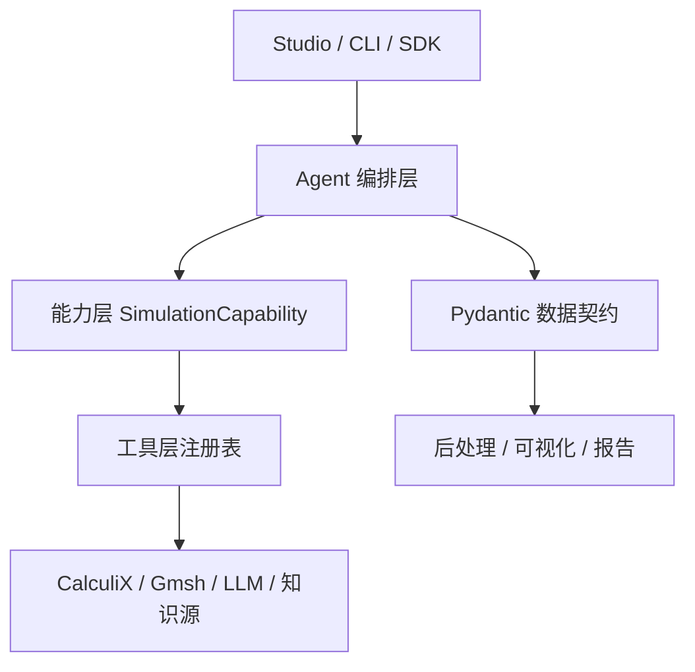
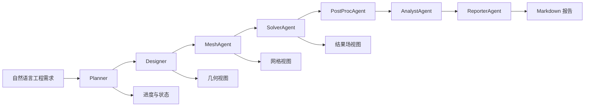

# 产品蓝图

MechAgent 是面向开源 CAE/FEA 工作流的多智能体仿真产品与编排框架。它不是单一求解器，也不是只面向验证算例的脚本集合；它由可直接使用的 Studio 工作台、可嵌入工程系统的 Python SDK、可自动化运行的 CLI、可扩展的 Agent 编排层和可注册的工具生态组成。

系统接收自然语言工程需求，将需求转化为可执行、可审计、可复现的仿真任务链路，并在 Studio、CLI 和 SDK 中输出统一的工程结果。当前发布边界聚焦结构线弹性静力分析，覆盖梁、矩形板、单孔/偏心孔/多孔薄板和矩形实体块的自然语言输入、参数建模、网格划分、真实求解、后处理、校核、3D 可视化和 Markdown 报告。TC-01 至 TC-05 承担回归校准，开孔薄板承担复杂几何前处理、布尔建模、局部网格控制和自由孔边界展示。后续分析类型、几何族、求解器和网格器通过能力注册与工具注册进入同一套框架。

## 产品定位

MechAgent 的核心目标是把“工程意图”转换为“可信仿真证据”。项目交付的不是一个固定物理域的封闭应用，而是一套具备可视化产品入口、结构化 Agent 通信、求解工具适配和质量验证证据的通用 CAE/FEA 工作流系统。

| 维度 | 定义 |
| --- | --- |
| 产品入口 | MechAgent Studio 本地工作台、CLI 命令、Python SDK |
| 输入形式 | 自然语言工程需求，支持中英文、单位解析、材料别名、复合请求拆分 |
| 编排核心 | Planner、Designer、MeshAgent、SolverAgent、PostProcAgent、AnalystAgent、ReporterAgent |
| 数据契约 | Pydantic v2 模型，覆盖意图、参数、网格、求解、后处理、误差和报告摘要 |
| 能力扩展 | `SimulationCapability` 声明自然语言解析、LLM 抽取契约、执行契约、默认工具和评价器 |
| 工具生态 | 求解器、网格器、后处理器、LLM 后端和知识源通过注册名、工厂函数和配置接入 |
| 可视化 | Three.js 3D 几何、网格和结果场，配套 PNG 导出和 SVG 兼容输出 |
| 可信机制 | 执行契约、有限数值校验、真实求解、解析参考、误差阈值、脱敏 trace |
| 发布证据 | 单元测试、真实 CalculiX 验证、自然语言案例、LLM smoke、前端构建、文档构建 |

## 用户体验目标

Studio 是默认产品入口。用户打开本地工作台后，应能在同一界面完成完整仿真链路：

1. 输入真实工程仿真需求。
2. 在运行前查看 Planner 预检结果，包括能力识别、几何类型、缺参诊断和复合任务拆分结果。
3. 复制当前工作台链接，用于协作沟通、文档示例和请求复现。
4. 复制当前请求对应的 CLI 复现命令，用于终端复跑或 CI 固化。
5. 查看后端作业编号、作业状态、运行耗时和阶段事件。
6. 在 3D 视口中切换几何、网格和结果模式。
7. 查看主结果、参考值、相对误差、验收结论和阶段产物路径。
8. 阅读、复制和下载自动生成的 Markdown 工程报告。
9. 复制或下载结构化摘要 JSON，用于外部系统复核、归档或复跑。
10. 回看本地运行历史，并重新打开历史结果。

CLI 面向终端用户、自动化脚本和 CI 工作流。`capabilities` 输出已注册能力、工具绑定和模型编号；
`examples` 输出完整自然语言示例库，并支持按能力编号、模型编号和几何类型过滤；`inspect` 输出运行前预检和缺参诊断；`run` 执行完整求解链路并返回
报告路径、输出目录和结构化摘要；`benchmark` 执行标准验证案例。CLI 与 Studio、SDK 共用同一套
能力注册表、示例库、Agent 编排图、求解配置和公开摘要结构。

界面设计以工程判读为优先级。布局稳定，信息密度适合反复使用；关键指标不因中文短词换行破坏阅读；按钮文本不溢出；结果视口是核心区域；左侧预检区用于快速判断请求是否可执行，下方检查区用于快速复核验收状态、阶段事件和链路状态。复合请求在 UI 中以预检摘要、任务矩阵和任务标签呈现，每个任务保持独立的几何、网格、结果、错误记录和报告摘要。

## 系统分层

| 层级 | 职责 | 主要契约 |
| --- | --- | --- |
| 交互层 | Studio、CLI、SDK | 消费预检结果、公开摘要、报告文本和可视化工件 |
| 编排层 | Planner、Designer、MeshAgent、SolverAgent、PostProcAgent、AnalystAgent、ReporterAgent | `MechAgentState`、`TaskRunRecord`、阶段输出模型 |
| 能力层 | 自然语言解析、LLM 抽取契约、执行契约、评价器 | 按能力注册消费任务，不围绕测试编号编码业务分支 |
| 工具层 | 求解器、网格器、后处理器、LLM、知识索引 | 以注册名、工厂函数和配置接入 |
| 数据层 | `ModelParams`、`MeshResult`、`SolverRunSummary`、`PostProcessingSummary` | Pydantic v2 强类型、可序列化、可脱敏 |

## 端到端链路

每个 Agent 只消费上游结构化输出，不依赖非结构化文本拼接。LangGraph DAG 和顺序工作流复用同一组 Agent、同一套 Pydantic schema 和同一套错误记录策略。Studio 只调用公开 API，不直接读写 Agent 内部状态。

## Agent 通信

1. Planner 将自然语言输入拆分为一个或多个 `TaskItem`，并生成 `SimulationIntent`。
2. Designer 将意图转换为 `ModelParams`，并保留 LLM trace 元数据。
3. MeshAgent 消费 `ModelParams`，启用 LLM Agent 时先生成并校验网格策略建议，再输出 `MeshAgentOutput` 和 `MeshResult`。
4. SolverAgent 根据能力声明和配置选择求解器，输出 `SolverRunSummary`。
5. PostProcAgent 解析求解输出，生成 `PostProcessingSummary`、位移场、应力场和可视化数据。
6. AnalystAgent 调用能力评价器计算验收指标、参考值和误差。
7. ReporterAgent 汇总结构化摘要、阶段产物和工程解释；启用 LLM Agent 时输出 LLM 工程解释章节。

复合请求中的任务按 `TASK_N` 工作目录隔离产物。单个任务失败时，失败任务进入 `failed_records` 和报告错误诊断，其余任务继续执行。最终摘要按 Planner 的原始任务顺序合并成功记录和失败记录。

## 能力模型

可执行仿真能力通过 `SimulationCapability` 注册。能力声明把自然语言入口、执行契约、工具选择和结果评价绑定到同一个工程语义单元。

| 字段 | 作用 |
| --- | --- |
| `capability_id` | 能力注册表编号 |
| `task_case_id` | Planner 输出的任务类别编号 |
| `parser` | 自然语言到 `ModelParams` 的本地解析函数 |
| `matcher` | 请求匹配函数 |
| `request_splitter` | 复合请求分段函数 |
| `missing_field_detector` | 缺参诊断函数 |
| `execution_validator` | 进入求解器前的工程契约检查 |
| `solver_name` / `mesher_name` | 能力默认工具注册名 |
| `llm_model_contract` | Designer LLM 参数抽取契约 |
| `model_case_ids` | 能力允许的模型编号集合 |
| `model_normalizer` | LLM 与本地解析输出的归一化函数 |
| `evaluator` | 主结果、参考值、误差和验收状态评价器 |

框架通用性来自能力声明、工具注册和结构化通信。每个扩展能力都应具备可验证输入、可复核输出、可解释报告和可自动化验收证据。

## 3D 可视化目标

浏览器端 3D 视图使用 Three.js。可视化层从结构化数据生成场景，不使用静态截图作为模型来源。Three.js 渲染层按几何类型映射求解坐标：梁保持横向弯曲坐标，矩形板和矩形实体块将求解 `Z` 轴映射为竖向轴。
3D 画布采用按需渲染策略：初始化、尺寸变化、视图切换和用户交互触发重绘，静止状态不运行连续动画循环。视口右下角使用独立 XYZ 全局坐标系小画布，坐标系跟随主相机旋转，不覆盖模型、网格和结果图例。

| 模式 | 数据来源 | 展示内容 |
| --- | --- | --- |
| 几何 | `ModelParams.geometry`、尺寸、边界和载荷区域 | 参数化外形、关键尺寸、固定区域、载荷方向 |
| 网格 | `.inp` 节点、单元、`MeshResult.metadata` | 节点、单元边、单元面、网格尺度和质量摘要 |
| 结果 | `.frd` 位移场、应力场、评价器输出 | 变形外形、位移模量、位移分量、可用应力场、图例、参考轮廓、验收指标 |
| 进度状态面板 | `TaskRunRecord`、阶段状态、错误记录 | 阶段状态、待执行步骤、失败位置和摘要 JSON 复制/下载 |

几何类型采用工程可读的表达方式：

- 梁：使用截面尺寸驱动的实体外形、固定端块、节点点云和变形对比。
- 板：使用单元面、边界支承、载荷箭头、位移标量场和应力标量场；开孔薄板在几何模式显示单孔或多孔参数化孔洞轮廓，在网格和结果模式读取 `.inp` 单元面表达孔边自由边界。梁网格以矩形截面分段棱柱表达 B31 单元拓扑，节点点标记显示单元连接位置。结果模式默认显示 `U` 位移模量，场量下拉菜单可切换 `Ux`、`Uy`、`Uz` 位移分量；`.frd` 存在应力场时可切换 `S Mises`、`Sxx`、`Syy`、`Szz`、`Sxy`、`Syz` 和 `Sxz`。边界条件和载荷从 `ModelParams` 进入可视化场景，几何模式显示固定端夹持、边界支承、集中力、线载荷、均布压力和端面载荷符号，结果模式只显示变形、网格边、结果场和颜色图例；壳单元 `.frd` 派生节点场按真实网格节点顺序对齐。
- 实体块：使用空间节点、单元边、端面边界、载荷面和变形外形。

## 当前发布能力

当前内置能力为结构线弹性静力分析：

- 梁：全局 Y 向横向弯曲，支持端点集中力和全跨均布线载荷。
- 矩形板：全局 Z 向均布压力弯曲，四边简支边界。
- 开孔薄板：矩形薄板单孔、偏心孔或多孔，Gmsh 布尔建模，外边界简支，孔边自由，纯全局 Z 向均布压力，主结果为最大位移。
- 矩形实体块：全局 X 向端面轴向载荷，支持应力输入和合力输入。

输入参数必须满足有限数值、单位可解析、材料可确定、边界和载荷区域可定位。材料库内置钢和铝；其他各向同性线弹性材料可通过显式 `E` 和 `nu` 输入。超出当前执行契约的任务返回缺参或不支持诊断，诊断结果进入报告和 UI 摘要。

## 发布级质量门槛

- SDK、CLI 和 Studio 共用同一套后端链路。
- Studio 运行请求进入后端作业模型，前端通过作业状态和阶段事件轮询更新运行监控。
- 标准验证案例使用真实求解器输出，并给出解析参考值、相对误差和阈值。
- 自然语言案例独立于标准验证案例。
- LLM Agent trace 脱敏输出，原始 prompt、response 和密钥不进入公开摘要。
- 3D 可视化覆盖几何、网格和结果模式。
- 文档、代码、配置和测试证据一致。
- `ruff`、`mypy`、`pytest`、前端构建、MkDocs 构建和清理脚本可通过。

## 路线图

路线图遵循“先形成可信闭环，再扩展物理域和工具生态”的顺序。

| 阶段 | 能力目标 | 验收证据 |
| --- | --- | --- |
| 0.1 结构静力闭环 | 梁、矩形板、单孔/偏心孔/多孔薄板、矩形实体块的自然语言到真实求解、3D 可视化和报告 | TC-01 至 TC-05、二十六个自然语言案例、LLM smoke、Studio 浏览器验证 |
| 0.2 复杂前处理泛化 | 多孔板、偏心孔、加强筋板、支架类二维轮廓、更多边界和载荷区域、参数扫描和批量任务 | 扩展工程工作流案例、网格收敛证据、UI 多任务验收 |
| 0.3 多分析类型 | 热分析、模态分析、瞬态动力学的能力声明、求解适配和可视化映射 | 每类分析的解析参考、真实求解、报告字段和可视化 |
| 0.4 工具生态 | 更多开源求解器、网格器、后处理器和知识源接入 | 工具注册测试、跨工具结果一致性、安装验证 |
| 0.5 发布级产品 | 插件包、示例库、公开 API 文档、任务队列和结果归档 | wheel 安装验证、端到端 UI 验收、文档站点和发布门禁 |

## 扩展机制

新的 CAE 场景通过以下路径进入框架：

1. 定义或复用 Pydantic 数据模型，明确几何、材料、载荷、边界、网格和求解选项。
2. 注册 `SimulationCapability`，声明自然语言分段器、解析器、LLM 抽取契约、执行契约、默认工具和评价器。
3. 注册网格器、求解器或后处理器工厂函数。
4. 为能力提供标准验证案例、自然语言案例、误差阈值和报告字段。
5. 在 Studio 中提供几何、网格和结果映射规则。

任何扩展都以可复现求解和可解释报告为最低交付边界。没有解析参考的场景可以使用工程基准、网格收敛或跨工具对比作为验收证据，并在能力文档中说明评价依据。
